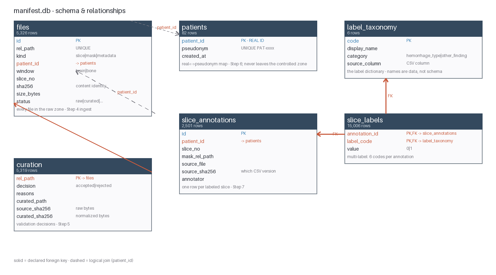
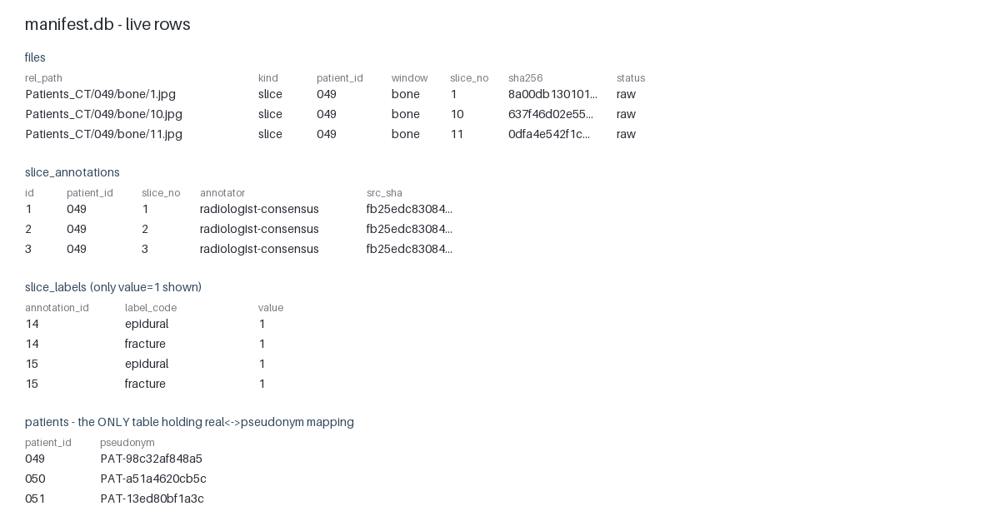

# MedImageForge

<p align="center">
  
</p>

<p align="center">
  <strong>End-to-End Medical Imaging Data Platform<br>for Continuous AI Model Improvement</strong>
</p>

<p align="center">
  
  
  
  
</p>

---

**MedImageForge** is a platform for collecting, organizing, annotating, validating, versioning, and delivering **medical imaging datasets** for machine-learning development.

It is built for regulated MedTech environments, where teams must always know:

| Question | Why it matters |
|----------|----------------|
| Where each image came from | Provenance & chain of custody |
| How the image was processed | Reproducibility |
| Who changed or annotated it | Accountability |
| Which dataset version trained a model | Experiment tracking |
| Whether the data passed quality checks | Trustworthiness |
| How access to sensitive data is controlled | Privacy & security |
| How datasets and workflows can be audited | Regulatory readiness |

---

## Local First Philosophy

> **Build order — local first, cloud later.**

The full vision includes cloud infrastructure (AWS / Azure).  
We deliberately build **everything locally first**, because you cannot understand a cloud ingestion pipeline until you can load and inspect a single image.

In **Phase 6** we map every local component to its cloud equivalent. By then each component’s job is obvious, so the mapping becomes straightforward.

---

## Dataset

All steps run on a real, public, anonymized dataset already present in `data/`:

**Computed Tomography Images for Intracranial Hemorrhage Detection and Segmentation**  
*(Hssayeni et al., PhysioNet — see `data/README.txt` and `data/LICENSE.txt`)*

| Property              | Value |
|-----------------------|-------|
| Patients              | 82 (`data/Patients_CT/049` … `130`) |
| Slices per patient    | ~30 (5 mm slice thickness) |
| Image format          | 650×650 grayscale JPG, two window settings per slice |
| Windows               | `brain/` (soft tissue — hemorrhage) and `bone/` (bone / fractures) |
| Slice labels          | `data/hemorrhage_diagnosis.csv` — multi-label per slice |
| Patient metadata      | `data/patient_demographics.csv` — age, gender, conditions |
| Segmentation masks    | `*_HGE_Seg.jpg` inside each `brain/` folder |
| Integrity             | `data/SHA256SUMS.txt` — official checksums |

### Why this dataset is ideal for learning

- Two “modalities” (brain / bone windows) + per-slice labels + segmentation masks → exercises every platform component
- Small enough to process on a laptop, yet messy enough (JPGs instead of DICOM, inconsistent slice counts) to teach real-world curation

> The original `data/split_data.py` is the dataset author’s reference script. It uses deprecated APIs (`scipy.misc.imread`). We will not rely on it — we write our own, better pipeline and learn *why* in the process.

---

## The Manifest Database

`artifacts/manifest.db` (SQLite) is the platform's **source of truth**. The filesystem is just bytes on disk — the manifest is where every file, every curation decision, every label, and the pseudonym map live as queryable rows.

**Why SQLite?** Zero infrastructure, transactional, single-file (easy to fingerprint for lineage). The schema is deliberately plain SQL so a cloud port (RDS Postgres, Step 17) is a dialect change, not a redesign.

<p align="center"></p>

| Table | Rows | What it records | Written by |
|---|---|---|---|
| `files` | 5,326 | every file in the raw zone: path, kind, patient, window, **sha256** | `ingest` (Step 4) |
| `curation` | 5,319 | per-file validation decision + source→curated hashes | `curate` (Step 5) |
| `patients` | 82 | **real ID ↔ pseudonym** — the only table with real IDs | `privacy` (Step 6) |
| `slice_annotations` | 2,501 | one row per labeled slice + provenance (source file, its sha256, annotator) | `load-labels` (Step 7) |
| `slice_labels` | 15,006 | multi-label values per annotation (6 codes each) | `load-labels` |
| `label_taxonomy` | 6 | the label dictionary — names are data, not schema | `load-labels` |

Live rows from the real database:

<p align="center"></p>

Three design properties worth noticing:

- **Provenance is columns, not a side system.** `source_sha256` in `curation` and `slice_annotations` links every derived fact back to the exact bytes it came from — that's what makes `audit --trace` able to walk backwards.
- **The privacy boundary is a table.** `patients` is the *only* place `049 ↔ PAT-98c32af848a5` is stored; the API resolves pseudonyms through it and never echoes `patient_id` back.
- **Labels are normalized, not a CSV column.** `slice_labels` × `label_taxonomy` means adding a new finding (e.g. `midline_shift`) is a new taxonomy row, not a schema migration.

Regenerate the diagrams: `python scripts/render_db_diagrams.py`

---

## The Roadmap

Six phases • Eighteen steps. Checkboxes track progress.

**Legend for every step**  
`Build` = what we create · `Why` = the concept it teaches · `Done` = how we verify it

---

### Phase 1 — Foundations & Knowing the Data

*Goal: a runnable project skeleton and a real understanding of the data.*

- [x] **Step 1 — Project skeleton**  
  **Build:** Python package under `src/medimageforge/`, virtualenv, `requirements.txt`, `pyproject.toml`, YAML config, logging, first CLI (`python -m medimageforge info`), first test.  
  **Why:** Every later component imports this foundation. Learn why code lives in an installable package, why configuration lives outside code, and why we use structured logging.  
  **Done:** `python -m medimageforge info` prints resolved config; `pytest` passes.

- [x] **Step 2 — Dataset explorer**  
  **Build:** Script that scans `data/`, parses both CSVs, verifies files against `SHA256SUMS.txt`, and prints a full report.  
  **Why:** You cannot build a pipeline for data you have not measured. Checksums teach **data integrity**.  
  **Done:** Report matches reality (82 patients, ~2.5k slices/window); checksum verification passes or reports mismatches.

- [x] **Step 3 — Image inspection**  
  **Build:** Load slices, display brain vs bone side-by-side, overlay `_HGE_Seg` mask, inspect pixel statistics.  
  **Why:** Understand CT windowing, what a segmentation mask is, and what a model will eventually see.  
  **Done:** Visually confirm a mask aligns with a hemorrhage region.

---

### Phase 2 — Ingestion, Curation & Privacy

*Goal: raw files become a trusted, queryable, de-identified dataset.*

- [x] **Step 4 — Ingestion pipeline & manifest**  
  **Build:** Ingest command that registers every file into a **manifest** (SQLite): patient, slice, window, path, SHA-256, size, status. Idempotent.  
  **Why:** A manifest is the platform’s source of truth. SQLite beats a CSV once you need queries and updates.  
  **Done:** Manifest row count matches explorer; re-running ingest changes nothing.

- [x] **Step 5 — Curation pipeline**  
  **Build:** Validation, duplicate detection, normalized copies written to a separate `curated/` zone + curation report.  
  **Why:** **Zone separation** (raw vs curated — never edit raw data in place) and **idempotent, resumable** pipelines.  
  **Done:** Curated zone contains only validated files; report lists every rejection with reason.

- [x] **Step 6 — Privacy & de-identification gate**  
  **Build:** Check that no PHI exists + pseudonymization of patient IDs in working artifacts (`049` → `PAT-a3f9…`).  
  **Why:** Difference between **anonymization** and **pseudonymization**. Privacy is a *gate* that must pass before anything downstream runs.  
  **Done:** Gate produces pass/fail privacy report; working artifacts contain no real patient numbers.

---

### Phase 3 — Annotations, Quality & Versioning

*Goal: labels become first-class data; datasets become reproducible releases.*

- [x] **Step 7 — Annotation model & label store**  
  **Build:** Clean annotation schema (per-slice multi-label + segmentation mask reference) loaded into the manifest DB with **provenance**.  
  **Why:** Labels are data too. Schema-before-storage is the lesson.  
  **Done:** For any slice we can query “labels + mask path + provenance” in one call.

- [x] **Step 8 — Automated quality gates**  
  **Build:** QC suite for mismatches, orphans, mask/label inconsistencies, near-duplicates (leakage!), demographic outliers.  
  **Why:** A dataset must **earn** its way to training. Quality gates turn a data lake into a trusted asset.  
  **Done:** Report catches at least one real inconsistency in the raw data.

- [x] **Step 9 — Dataset versioning**  
  **Build:** Patient-level train/val/test split → immutable snapshot `datasets/v1.0/` + dataset card.  
  **Why:** Reproducibility — “which data trained this model?” must always be answerable. Patient-level split is the #1 anti-leakage rule.  
  **Done:** `v1.0` is reproducible from the manifest; no patient appears in two splits.

---

### Phase 4 — ML Integration & the Improvement Loop

*Goal: versioned data flows into a model; model errors flow back as better data.*

- [x] **Step 10 — Baseline model**  
  **Build:** PyTorch slice-level classifier trained on `v1.0`. Each run records dataset version, code version, config, metrics.  
  **Why:** Dataset → DataLoader → model → metrics chain. Experiment records must reference a *dataset version*.  
  **Done:** Model trains and beats a trivial baseline; run record is complete.

- [x] **Step 11 — Evaluation & error analysis**  
  **Build:** Per-class metrics, confusion matrix, hardest slices, patient-level aggregation.  
  **Why:** Aggregate metrics lie. Patient-level metrics are the honest number.  
  **Done:** We can name the specific slices/patients the model fails on.

- [x] **Step 12 — Active learning loop**  
  **Build:** Score by uncertainty → queue hard cases → simulate reviewer → release `datasets/v1.1` → retrain → compare.  
  **Why:** Closes the central loop: **Data → Model → Errors → Better data → Better model**.  
  **Done:** Documented before/after comparison on the same test split.

---

### Phase 5 — Platform Services

*Goal: the pipelines become a platform other programs can talk to.*

- [x] **Step 13 — Lineage & audit log**  
  **Build:** Every pipeline run appends an audit record. Query full ancestry of any artifact.  
  **Why:** Traceability is the core regulated-MedTech requirement — and the best debugging tool.  
  **Done:** Pick a file in `v1.1` and print its complete history.

- [x] **Step 14 — API service**  
  **Build:** FastAPI service exposing patients, slices, labels, dataset versions, QC status.  
  **Why:** A service boundary forces clean data access patterns and is the future home of access control.  
  **Done:** Query the manifest over HTTP; the UI uses only this API.

- [x] **Step 15 — Dataset browser UI**  
  **Build:** Minimal viewer (Streamlit or FiftyOne) to browse patients, windows, overlays, and labels.  
  **Why:** Humans must be able to *see* the data.  
  **Done:** Browse any patient; visually verify labels and masks.

---

### Phase 6 — Production-Readiness & Cloud Mapping

*Goal: the learning prototype becomes a defensible, documented system.*

- [x] **Step 16 — Tests, CI & packaging**  
  **Build:** Fuller pytest suite, GitHub Actions CI, Dockerfile.  
  **Why:** A pipeline nobody can re-run or deploy is a script, not a platform.  
  **Done:** CI runs green on a clean checkout; Docker image runs the CLI.

- [x] **Step 17 — Cloud architecture mapping**  
  **Build:** Documented mapping of every local component to its cloud equivalent + IaC sketch. Optionally one real cloud adapter.  
  **Why:** Once you know what each component *does*, the cloud version is “the same job, different substrate”.  
  **Done:** An architecture document a cloud engineer could implement from.

- [x] **Step 18 — Compliance documentation & final review**  
  **Build:** SOP templates, risk register, audit-trail evidence samples, dataset/model cards, final README polish.  
  **Why:** In MedTech, *evidence* is a deliverable.  
  **Done:** A reviewer could audit our data’s journey end-to-end from the docs alone.

---

## Core Capabilities

| Capability | Description | Steps |
|------------|-------------|-------|
| **1. Secure ingestion** | Continuously receive imaging data with validation, integrity checks, metadata, logging, and controlled access | 2, 4, 6 |
| **2. Data curation** | Organize, detect invalid/duplicate files, validate metadata, tag, filter, track preprocessing | 5 |
| **3. Annotation & AI-assisted annotation** | Classes, boxes, 2D/3D segmentation. Models can suggest labels for human review | 7, 12, 15 |
| **4. Active learning** | Send the model’s uncertain cases to annotators. Feedback loop: Data → Annotation → Model → Errors → Better data | 11–12 |
| **5. Data lineage** | “Where did this image come from and what happened to it?” Full chain from raw → model | 13 |
| **6. Dataset versioning** | Immutable snapshots (v1.0 → v1.1 → v2.0). Always know which version trained a model | 9 |
| **7. Quality control** | Automated checks for missing/corrupt files, bad metadata, duplicates, leakage — enforced as gates | 8 |
| **8. Governance & access control** | RBAC, least-privilege, encryption, audit logging, retention | 6, 13, 14, 17 |
| **9. Regulatory support** | De-identification, audit trails, SOPs, validation protocols, risk assessment, traceability | 6, 13, 18 |

---

## Key Technologies

| Area              | We actually use                          | Vision-level (Phase 6)                          |
|-------------------|------------------------------------------|-------------------------------------------------|
| Language          | Python 3.10                              | Python (+ C++ only if profiled hotspot)         |
| Medical imaging   | Pillow, NumPy                            | SimpleITK, ITK, OpenCV, MONAI                   |
| Labels / masks    | pandas, our schema                       | CVAT, FiftyOne, MONAI Label                     |
| ML                | PyTorch                                  | PyTorch, TensorFlow                             |
| Data platform     | SQLite manifest, filesystem zones        | DVC, S3, Glue, RDS / DynamoDB                   |
| Services          | FastAPI (Step 14)                        | API Gateway, Lambda, SageMaker                  |
| Ops               | pytest, GitHub Actions, Docker           | CI/CD, IaC, monitoring, SLOs                    |

---

## Architecture Concept

```text
Medical Data Sources (data/Patients_CT)
          │
          ▼
Secure Ingestion  (Step 4)  ──►  manifest + checksums
          │
          ▼
     ┌────┴────┐
     │ Raw zone │  ← never modified
     └────┬────┘
          ▼
De-identification Gate  (Step 6)
          │
          ▼
Data Curation  (Step 5)  ──►  curated/ zone + report
          │
     ┌────┴────┐
     ▼         ▼
Quality     Annotation
Control     (Steps 8 / 7)
     │         │
     └────┬────┘
          ▼
Dataset Versioning  (Step 9)  ──►  datasets/v1.0, v1.1, …
          │
          ▼
AI / ML Platform  (Steps 10–11)
          │
     ┌────┴────┐
     ▼         ▼
 Training   Evaluation
     │         │
     └────┬────┘
          ▼
Active Learning  (Step 12)
          │
          ▼
New / Hard Cases  ──►  back to Annotation  ──►  Improved Dataset

---

# Project Structure

```text
MedImageForge/
│
├── README.md                  ← you are here (vision + roadmap)
├── requirements.txt           ← runtime dependencies (grows per step)
├── pyproject.toml             ← makes src/medimageforge installable (pip install -e .)
├── .gitignore
│
├── configs/
│   └── default.yaml           ← all paths/settings live here, not in code
│
├── data/                      ← CT-ICH dataset (gitignored — never commit data)
│   ├── Patients_CT/           ← 82 patients × (brain/ + bone/ windows)
│   ├── hemorrhage_diagnosis.csv
│   ├── patient_demographics.csv
│   ├── SHA256SUMS.txt
│   └── README.txt, LICENSE.txt, ct_ich.yml, split_data.py   (dataset originals)
│
├── docs/
│   ├── steps/                 ← per-step learning notes: what/why/how (Steps 1-18)
│   ├── cloud-architecture.md  ← local→cloud component mapping (Step 17)
│   └── compliance/            ← SOPs, risk register, evidence, cards (Step 18)
│
├── infra/                     ← Terraform sketch of the cloud architecture (Step 17)
│
├── src/
│   └── medimageforge/         ← the installable package (all logic lives here)
│       ├── __init__.py
│       ├── __main__.py        ← enables: python -m medimageforge
│       ├── cli.py             ← command-line entry point
│       ├── config.py          ← config loading + path resolution
│       └── logging_utils.py   ← one logging setup for the whole platform
│
├── scripts/                   ← thin wrappers that call into the package
├── notebooks/                 ← exploration (Step 3)
└── tests/                     ← pytest suite (grows per step)
```

---

# Getting Started

```powershell
# 1. Clone and enter
git clone <repo-url>; cd MedImageForge

# 2. Create and activate the virtual environment
python -m venv .venv
.venv\Scripts\Activate.ps1

# 3. Install dependencies + the package itself (editable)
pip install -r requirements.txt
pip install -e .

# 4. Verify the foundation works
python -m medimageforge info
pytest
```

> **CPU-only PyTorch:** `torch==…+cpu` is not on PyPI — install with
> `pip install -r requirements.txt --extra-index-url https://download.pytorch.org/whl/cpu`
> (extra index, not `--index-url` — see `docs/steps/step-16-tests-ci-packaging.md`).

---

# Running the Pipeline

> **Activate the venv first** — `python -m medimageforge` fails with
> `No module named medimageforge` if the system Python runs instead:
> `source .venv/bin/activate` (Linux/macOS) or `.venv\Scripts\Activate.ps1` (Windows).

## Full pipeline (fresh checkout with data in place)

Each step reads the previous step's artifacts — order matters:

```bash
# data stages
python -m medimageforge ingest        # hash + register raw files → manifest.db
python -m medimageforge curate        # validate + normalize → artifacts/curated/
python -m medimageforge privacy       # PHI gate → pseudonymized artifacts/deid/
python -m medimageforge load-labels   # labels CSV → manifest label store
python -m medimageforge qc            # quality gates (gate: PASS required)
python -m medimageforge release       # publish immutable datasets/vX.Y

# model stages
python -m medimageforge train         # trains on the release → artifacts/runs/<id>/
python -m medimageforge evaluate      # metrics + error analysis (latest run)

# services (separate terminals)
python -m medimageforge serve         # API on :8000
python -m medimageforge ui            # Streamlit on :8501

# integrity
python -m medimageforge audit --verify
```

## Re-running after a change — only re-run what depends on it

| You changed… | Re-run |
|---|---|
| `training.epochs` / hyperparameters | `train`, then `evaluate` — nothing upstream is affected |
| the label CSV | `load-labels` → `qc` → bump `release.version` → `release` |
| data files in `data/` | `ingest` → `curate` → `privacy` → `load-labels` → `qc` → new `release` → `train` → `evaluate` |
| nothing | nothing — `info`, `audit`, `serve`, `ui` work anytime |

## Rules the CLI enforces (so you don't have to remember)

- **`release` refuses to overwrite** an existing version — bump
  `release.version` in `configs/default.yaml` to publish a new snapshot.
  `--force` exists but defeats the point of immutability.
- **`train` never overwrites a run** — each invocation writes a new
  `artifacts/runs/run-<timestamp>/`, so experiments are comparable.
- **`evaluate` is read-only** — the threshold comes from the run record,
  never re-tuned on test.
- **Overrides without editing config:** `train --epochs 25`,
  `qc --skip-leakage`, `release --verify`, `active-learning --seeds 8`.
- **Every command appends to `artifacts/audit.log`** — actor, argv, config
  hash, input/output fingerprints. `audit --trace <path>` reconstructs
  lineage; `audit --verify` proves the log wasn't edited.

---

# Documentation

| Where | What |
|---|---|
| `docs/steps/` | 18 step-by-step write-ups — what was built, why, the bugs found |
| `docs/cloud-architecture.md` + `infra/` | every local component mapped to AWS/GCP/Azure + Terraform sketch |
| `docs/compliance/` | audit-ready package: data journey, evidence samples, SOPs, risk register, model card |

---

# Success Criteria

- Securely ingest imaging data and prove file integrity
- Handle 2D slices and multi-window studies
- Pass a privacy gate and keep working artifacts pseudonymized
- Curate automatically with a rejection report
- Query labels + masks + provenance in one call
- Enforce quality gates before dataset release
- Produce immutable, patient-split dataset versions
- Train and evaluate a model on a named dataset version
- Feed model errors back into an improved dataset (v1.1)
- Trace any artifact's full lineage; expose the platform via API

---

# Compliance Notice

MedImageForge is designed to **support** medical-data security, privacy, quality, traceability, and regulated software-development processes. It must not be described as inherently "HIPAA-compliant" or "FDA-compliant." Actual compliance depends on architecture, cloud configuration, security controls, organizational policies, BAAs where applicable, validation activities, quality-management processes, intended use, product classification, and applicable law. A formal compliance assessment is required for any real production implementation.

---

# License

**Proprietary — Internal MedTech use only.**

Dataset license: see `data/LICENSE.txt` (PhysioNet — PhysioNet Credentialed Health Data License / dataset-specific terms).
